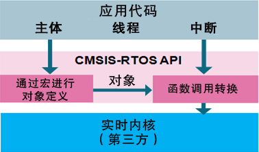

# CMSIS-RTOS
​	本项目实现了将RT-Thread内核API封装为CMSIS-RTOS API。

​	CMSIS-RTOS是ARM公司为统一操作系统、降低嵌入式门槛而发布的操作系统标准软件接口（它本身不是一个操作系统，仅仅是一个封装层）。通俗讲，CMSIS-RTOS将操作系统（FreeRTOS、RT-Thread等）屏蔽起来，然后提供CMSIS-RTOS接口函数给最终使用者调用。如此以来，最终使用者只需要使用一套CMSIS-RTOS的API即可轻松实现跨操作系统的移植，从而降低学习门槛。目前，FreeRTOS、RT-Thread、RTX、mbedOS等均提供了该接口。

​	

​	CMSIS-RTOS分为两个版本，分别是RTOSv1和RTOSv2。RTOSv1为老版本，目前普遍使用RTOSv2。

​	官网：https://www.keil.com/pack/doc/CMSIS/RTOS2/html/index.html

## CMSIS 简介

Cortex微控制器软件接口标准（Cortex Microcontroller Software Interface Standard）是ARM和一些编译器厂家以及半导体厂家共同遵循的一套标准，是由ARM专门针对CORTEX-M系列提出的标准。在该标准的约定下，ARM和芯片厂商会提供一些通用的API接口来访问Cortex内核以及一些专用外设，以减少更换芯片以及开发工具等移植工作所带来的金钱以及时间上的消耗。只要都是基于Cortex内核的芯片，代码均是可以复用的。CMSIS是 Cortex-M 处理器系列的与供应商无关的硬件抽象层。使用 CMSIS可以为处理器和外设实现一致且简单的软件接口，从而简化软件的重用、缩短微控制器新开发人员的学习过程，并缩短新设备的上市时间。

CMSIS 包含以下组件：

- CMSIS-Core：提供与 Cortex-M0、Cortex-M3、Cortex-M4、SC000 和 SC300 处理器与外围寄存器之间的接口。

- CMSIS-DSP：包含以定点（分数 q7、q15、q31）和单精度浮点（32 位）实现的 60 多种函数的 DSP 库。

- CMSIS-RTOS：用于线程控制、资源和时间管理的实时操作系统的标准化编程接口。

- CMSIS-SVD：包含完整微控制器系统（包括外设）的程序员视图的系统视图描述 XML 文件。
- CMSIS-DAP：CMSIS-DAP（调试访问端口）为调试接口适配器的参考设计，其支持USB到JTAG/串行协议的转换，这样低成本的调试适配器可以用于多种开发工具链。